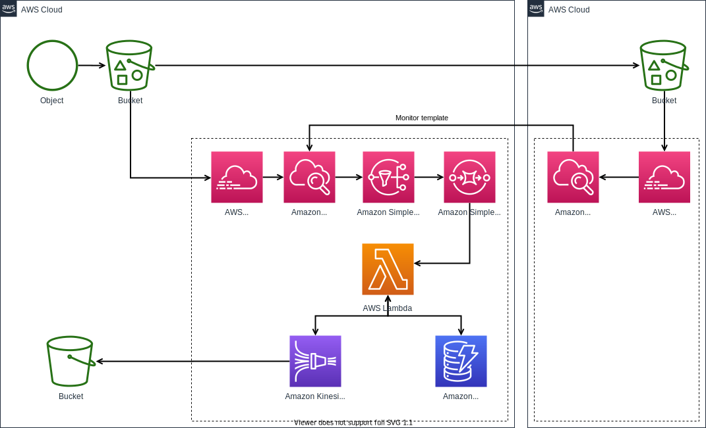

# Case PLD
- Projeto referente ao case PLD fornecido como estudo de caso para o banco Itaú.

# Visão arquitetural - Infraestrutura e componentes

# Descrição da solução
- Foi idealizado uma esteira de execução, onde o dado representativo de uma "Transação bancária" caminha entre componentes com responsabilidades distinas, desta forma, produzindo baixo acoplamento entre eles e passível de evolução por funcionalidade.
- A solução visa atender tanto aplicações legadas que possuam comunicação via FTP, quanto aplicações modernas, sejam orientadas a serviços (Rest API), sejam orientadas a eventos (Mensageria - Kafka).
- Um aspecto importante desta solução é a utilização da plataforma ELK, Elastic Search, Logstash e Kibana, que permite tanto a busca de dados com baixa latência quanto a identificação de padrões, através de ferramentas analíticas e recursos amparados pela tecnologia Lucene.
- Cada componente deste arquitetura é passível de escalonamento vertial e principalmente horizontal, sua elasticidade promove tanto economia quanto poder computacional quando o cenário demandar.
- Cada componente é passível de substituição por outra tecnologia, bastando obedecer o contrato definido o fluxo.

# Descrição do workflow
- A solucão utilizada compreende em executar um fluxo de ingestão de dados por três vias:
    - **LEGACY-PRODUCER**: Atenderá aplicações legadas que utilizem comunicação via FTP;
    - **MODERN-PRODUCER-A**: Atenderá aplicações atuais via um endpoint para postagem de dados (rest-api);
    - **MODERN-PRODUCER-B**: Atenderá aplicações atuais via um tópico no kafka para transporte de dados (event-based);
- Todos os três fluxos destinam os dados a um tópico centralizador no kafka chamado "**TRANSACTIONS**";
- Após a ingestão, a próxima etapa do processo é a extração dos dados, transformação e load, de responsabilidade da aplicação **LOADER**;
- O resultado do processo da etapa 3 é indexação do dado em um índice no Elastic Search, plataforma utilizada para exploração de padrões e modelos voltados a prevenção de fraudes e lavagem de dinheiro;
- Dentro da plataforma **ELK** (Elastic Search, Logstash e Kibana), podem ser criados jobs analíticos de busca de padrões;
- O resultado da triagem obtida após execução dos jobs é o disponibilizado em outro índice exploratório destinado a análise manual pelos analistas/cientistas de dados responsáveis.

# Ferramental utilizado
- A solução utiliza as seguintes tecnologias e ferramentas:
    - Stack ELK
        - Elastic Search
        - Logstash
        - Kibana
    - FTP
        - Pure-FTP
    - Event Broker
        - Kafka
    - Aplicações
        - Java 11
        - Framework Quarkus
        - Framework Camel
        - Vertx
    - Docker
    
# Simulação do processo legado
1 - Clonar o projeto do github:
    - git clone https://github.com/abenas/case_pld.git
2 - Subir a infraestrutura do FTP, disponível em infra/ftp:
    - docker-compose up -d
3 - Subir a infraestrutura do Kafka, disponível em infra/kafka:
    - docker-compose up -d
4 - Subir a infraestrutura ELK, disponível em infra/elk:
    - docker-compose up -d
3 - Subir as aplicações:
    3.1 - Loader
    3.2 - Legacy-producer
4 - Submeter um arquivo de dados representativo do legado, disponível em data
    4.0 - Entrar na pasta infra/data
    4.1 - Executar o comando: ftp localhost
    4.2 - Executar o comando: send data-small.csv d1.csv

## Comportamento esperado

    1 - O arquivo data-small.csv será enviado por ftp ao servidor local.
    2 - A aplicação legacy-producer utiliza o framework Camel para integração e processamento orientado a rotas.
    3 - Existe uma rota configurada para efetuar um pooling no servidor ftp local, de tempos em tempos em busca de arquivos a serem processados.
    4 - Após o envio do arquivo data-small.csv, a rota FtpServer será iniciada e realizará o download do arquivo (d1.csv).
    5 - O arquivo d1.csv será processado então pelo handler de processamento de arquivos.
    6 - O handler responsável chama o serviço TransactionService, que por sua vez postará no tópico Transactions.
    7 - Após o dado estar disponível no tópico Transactions, a aplicação LOADER irá realizar o tratemento dos eventos existentes.
    8 - Por fim, o dado é disponibilizado no Elastic Search para ingestão no índice de análise.

# Simulação do processo atual
1 - Clonar o projeto do github:
    - git clone https://github.com/abenas/case_pld.git
2 - Subir a infraestrutura do Kafka, disponível em infra/kafka:
    - docker-compose up -d
3 - Subir a infraestrutura ELK, disponível em infra/elk:
    - docker-compose up -d
4 - Subir as aplicações:
    3.1 - Loader
    3.2 - Modern-producer-a
    3.3 - Modern-producer-b
5 - Submeter uma requisição POST em localhost:8081/transactions com o corpo de uma transação (data/data.json)
    - curl -XPOST localhost:9200/transactions -d '{"fiscalYear":2020,"fiscalPeriod":1,"department":"DEPART_X","division":"DIVISION_Y","merchant":"EU","category":"PC","creationDate":"01/30/2020","amount":1000}'
    - Também foi disponibilizado uma collection em data/pld-postman-collection.json pré configurado com a mesma requisição.
6 - Publicar um evento via KafkaAdmin em localhost:9092, topico bridge:
    - cd /PATH_KAFKA_ADMIN/bin
    - ./kafka-console-producer.sh --bootstrap-server localhost:9092 --topic bridge < PATH_PROJETO/case_pld/data/data.json 

## Comportamento esperado

    1 - O arquivo data-small.csv será enviado por ftp ao servidor local.
    2 - A aplicação legacy-producer utiliza o framework Camel para integração e processamento orientado a rotas.
    3 - Existe uma rota configurada para efetuar um pooling no servidor ftp local, de tempos em tempos em busca de arquivos a serem processados.
    4 - Após o envio do arquivo data-small.csv, a rota FtpServer será iniciada e realizará o download do arquivo (d1.csv).
    5 - O arquivo d1.csv será processado então pelo handler de processamento de arquivos.
    6 - O handler responsável chama o serviço TransactionService, que por sua vez postará no tópico Transactions.
    7 - Após o dado estar disponível no tópico Transactions, a aplicação LOADER irá realizar o tratemento dos eventos existentes.
    8 - Por fim, o dado é disponibilizado no Elastic Search para ingestão no índice de análise.

# Perguntas

    1. Qual é a sua estratégia para modernizar esse legado?

    É proposto uma solução arquitetural que possibilite a interoperabilidade entre sistemas legados e modernos, para que não haja interrupção do fluxo do processamento de informações atual e possibilite margem para evolução de outros sistemas adjacentes.
 
    2. Escolha uma funcionalidade prioritária para modernizar.

    A idéia é levar o dado até a plataforma ELK para análise com base em modelos preditivos.

    3. Quais os critérios você adotou para priorizar a funcionalidade a ser modernizada?

    A plataforma ELK oferece diversas abordagens para exploração dos dados, seja através de ferramentas de visualização (gráficos), seja atráves de aplicação de modelos computacionais que exploram anomalias e comportamentos identificados. É possível a utilização de scripts em Python para flexibilizar as estratégias de exploração.

    4. Quais seriam os requisitos imprescindíveis para essa funcionalidade?

    A plataforma ELK é onde se concentra todo a execução do fluxo de exploração dos dados. Sua substituição pode ser realizada sem quebra dos componentes anteriores a ingestão, entretanto, aumentaria o tempo de desenvolvimento das ferramentas alternativas.    

    5. Como será a convivência desta funcionalidade modernizada com o legado? (Visão técnica)

    A idéia é oferecer uma esteira de trabalho que possibilidade uma migração em paralelo, sem interrupção do fluxo do legado.

    6. Quais serão os fatores críticos para o sucesso da modernização dessa funcionalidade?

    O principal fator para sucesso desta solução é a descentralização dos dados através de multiplas vias de consumo.

    7. Quais seriam as linguagem e tecnologias envolvidas na solução e por quê?

    Como linguagem base para as aplicações de ingestão, Java, Quarkus e framworks adjacentes. Como tecnologia, ftp para o legado, um broker de mensageria Kafka para o moderno. A plataforma Java é amplamente utilizada, possibilita o uso de diversas DSLs, performance em versões mais atualizadas é equiparável a outras tecnologias mais específicas. Quarkus é um framework moderno que aborda conceitos como reatividade, um paradigma que por sua vez traz ganhos quanto a utilização inteligente de recursos através de do consumo sob demanda. O Ftp é um protocolo comum e sistemas legados tendem a ter comunicação orientada a arquivos. A idéia de uso de um broker como o Kafka é aumentar o paralelismo no processamento de dados através de consumo de eventos, trazendo ganhos como descentralização de dados, performance e flexibilidade para interagir com outras tecnologias facilmente. A Stack ELK possibilita a indexação de dados e buscam em baixa latência, voltada a um paradigma distribuído por shards e replicas, que possibilita o crescimento sob demanda e poder computacional proporcional a infraestrutura. O Kibana é uma ferramenta de exploração de dados que agrega diversas tecnologias modernas como detecção de anomalias através de aprendizado de máquina, identificação de padrões, bem como o visualização de dados através de gráficos.

    8. Como você irá armazenar esses dados (tecnologias e modelos)?

    Será armazenado no Elastic Search, utilizando um data stream com policies de retenção e movimentação de dados em uma infraestrutura hot-warm-cold.

    9. Como a performance será otimizada de um jeito que ficará fácil de escalar?
    
    As aplicações rodam em containers que podem ser orquestrados por um kubernetes para fácil administração. O cluster kafka e o cluster do elastic search podem ser escalados bastando-se inserir novos nós.

    10. Dado que é um projeto importantíssimo para a organização, como você faria para acelerar o desenvolvimento, entregando valor para o cliente em menor tempo?

    Utilizando tecnologias consolidados e amplamente utilizadas no mercado, com cases provados e templates para os cenários possíveis.

    11. Criar uma solução simples no GitHub ou qualquer repositório open source voltado à microserviços que utilize a stack java, Quarkus ou Eclipse Vertx, podendo utilizar um banco como MongoDB. A solução não será buildada local porem faremos analise e questionaremos da solução em cima do código fonte durante a entrevista com o candidato.

    https://github.com/abenas/case_pld

