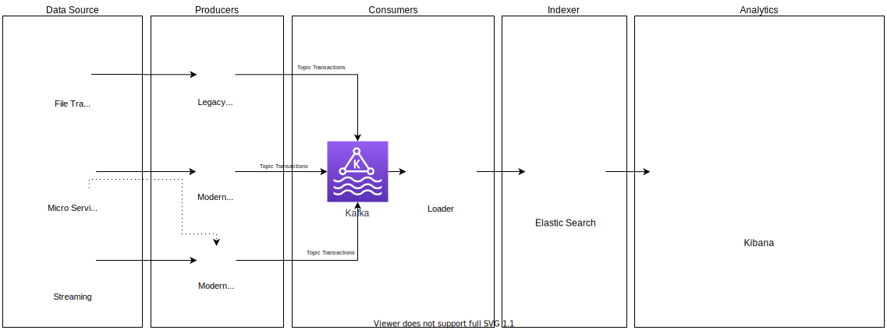

# Case PLD
- Projeto referente ao case PLD fornecido como estudo de caso para o banco Itaú.

# Visão arquitetural

# Descrição da solução
- Foi idealizado uma esteira de execução, onde o dado representativo de uma "Transação bancária" caminha entre componentes com responsabilidades distinas, desta forma, produzindo baixo acoplamento entre eles e passível de evolução por funcionalidade.
- A solução visa atender tanto aplicações legadas que possuam comunicação via FTP, quanto aplicações modernas, sejam orientadas a serviços (Rest API), sejam orientadas a eventos (Mensageria - Kafka).
- Um aspecto importante desta solução é a utilização da plataforma ELK, Elastic Search, Logstash e Kibana, que permite tanto a busca de dados com baixa latência quanto a identificação de padrões, através de ferramentas analíticas e recursos amparados pela tecnologia Lucene.
- Cada componente deste arquitetura é passível de escalonamento vertial e principalmente horizontal, sua elasticidade promove tanto economia quanto poder computacional quando o cenário demandar.
- Cada componente é passível de substituição por outra tecnologia, bastando obedecer o contrato definido o fluxo.

# Descrição do workflow
- A solucão utilizada compreende em executar um fluxo de ingestão de dados por três vias:
    - **LEGACY-PRODUCER**: Atenderá aplicações legadas que utilizem comunicação via FTP;
    - **MODERN-PRODUCER-A**: Atenderá aplicações atuais via um endpoint para postagem de dados (rest-api);
    - **MODERN-PRODUCER-B**: Atenderá aplicações atuais via um tópico no kafka para transporte de dados (event-based);
- Todos os três fluxos destinam os dados a um tópico centralizador no kafka chamado "**TRANSACTIONS**";
- Após a ingestão, a próxima etapa do processo é a extração dos dados, transformação e load, de responsabilidade da aplicação **LOADER**;
- O resultado do processo da etapa 3 é indexação do dado em um índice no Elastic Search, plataforma utilizada para exploração de padrões e modelos voltados a prevenção de fraudes e lavagem de dinheiro;
- Dentro da plataforma **ELK** (Elastic Search, Logstash e Kibana), podem ser criados jobs analíticos de busca de padrões;
- O resultado da triagem obtida após execução dos jobs é o disponibilizado em outro índice exploratório destinado a análise manual pelos analistas/cientistas de dados responsáveis.

# Simulação do processo
1 - Clonar o projeto do github (https://github.com/abenas/case_pld.git)